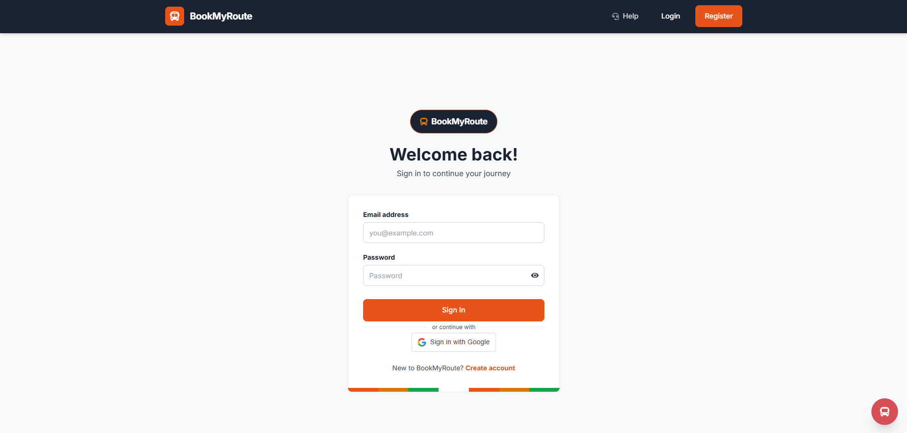
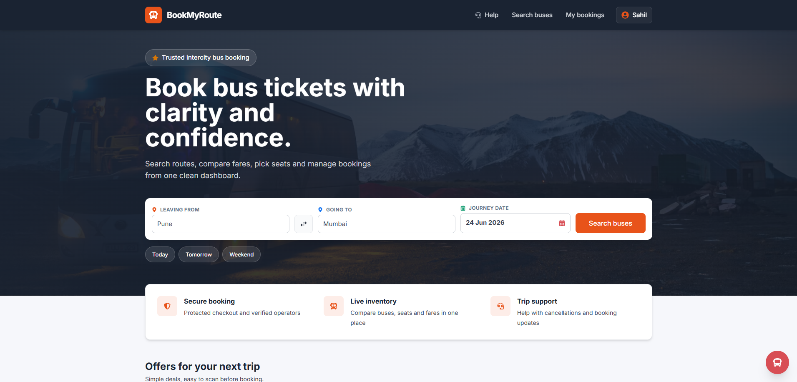
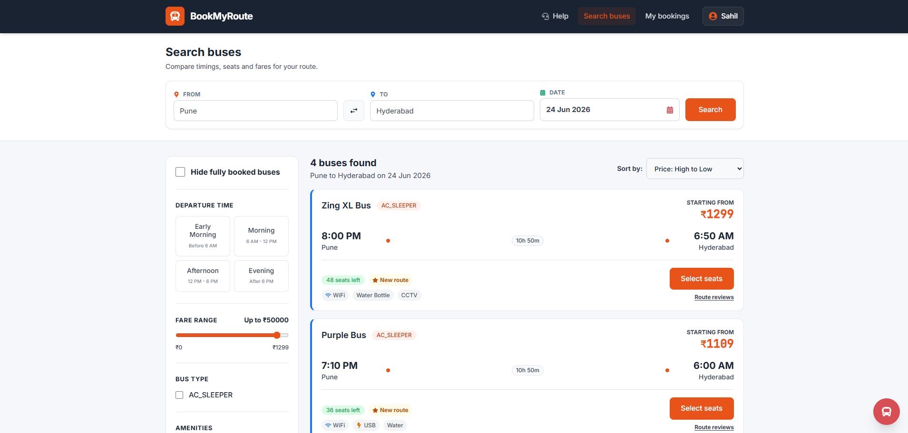
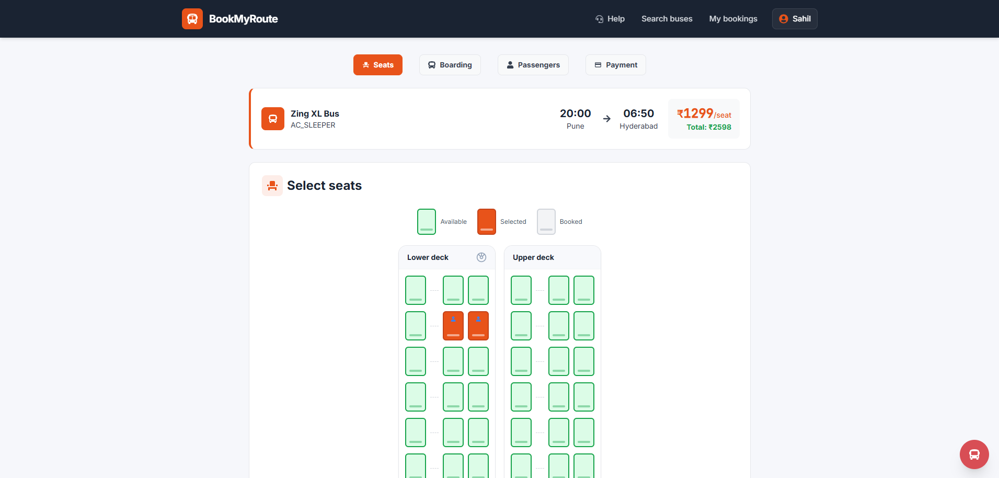
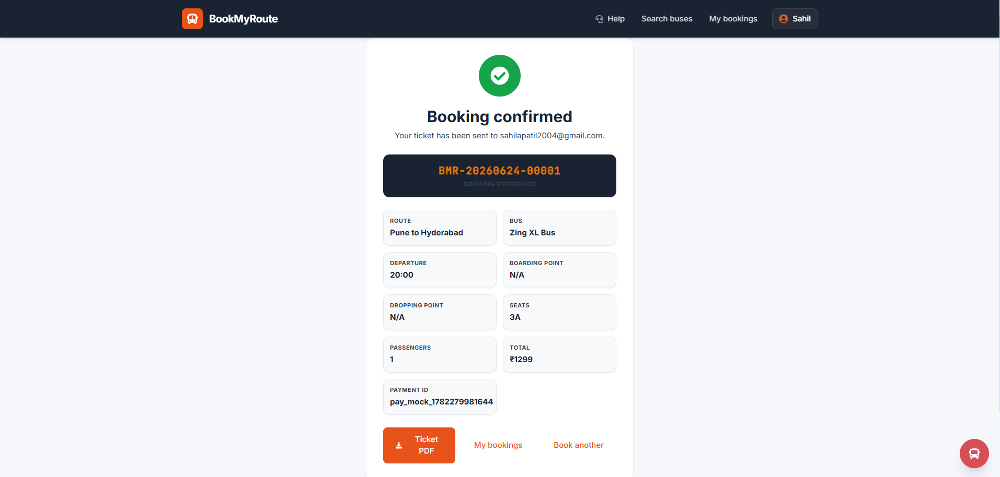
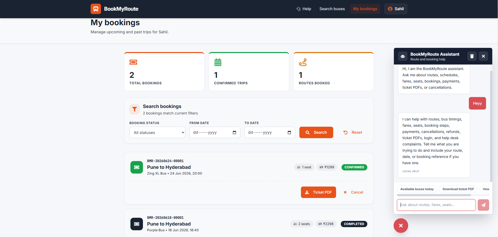

<div align="center">


</div>

<p align="center">


</p>

<p align="center">

<a href="https://github.com/ShrutiKasbe">

</a>

<a href="https://linkedin.com/in/shruti-kasbe-237384297">

</a>

<a href="mailto:kasbeshruti04@gmail.com">

</a>

</p>

<p align="center">


</p>

---

# 👩‍💻 About Me

Hi there! 👋

I'm **Shruti Kasbe**, an **Entry-Level Java Full Stack Developer** and **Computer Engineering student** passionate about building scalable web applications using modern technologies.

💜 I enjoy solving real-world problems through code and continuously improving my backend and frontend development skills.

---

## 🚀 Currently Learning

- Spring Boot
- React.js
- REST API Development
- MySQL
- AWS Cloud
- Data Structures & Algorithms

---

## 💼 Open To

- Java Full Stack Developer Roles
- Software Engineer
- Backend Development
- Spring Boot Developer
- Internship & Full-Time Opportunities

---

## 🌟 Quick Facts

- 🎓 B.E. Computer Engineering (2026)
- 📍 Pune, Maharashtra
- 💻 Java Full Stack Developer
- 🌱 Passionate about Full Stack Development
- 🚀 Love Building Real-World Projects

---

# 🛠 Tech Stack

## 💻 Languages

<p align="center">

</p>

## 🎨 Frontend

<p align="center">

</p>

## ⚙️ Backend

<p align="center">

</p>

## 🛠 Tools & Platforms

<p align="center">

</p>

---

# 💼 Experience

## 🚀 Java Full Stack Developer Intern
### SANYU INFOTECH PVT. LTD. | Oct 2025 – Mar 2026

- Developed CRM modules using **Java** and **Spring Boot**
- Built and tested REST APIs
- Integrated frontend with backend services
- Worked with MySQL & MongoDB
- Used Git & GitHub for version control
- Collaborated with developers using Agile methodology

**Tech Stack**

`Java` • `Spring Boot` • `React.js` • `REST API`
`MySQL` • `MongoDB` • `Git` • `GitHub`

---

# 🚀 Featured Project

# 🚌 BookMyRoute – Online Bus Ticket Booking Portal

> A modern Full Stack Bus Ticket Booking Platform built using **Java, Spring Boot, React.js and MySQL**

## ✨ Key Features

- 🔐 JWT Authentication
- 🔑 Google OAuth Login
- 🤖 AI Chatbot
- 🚌 Smart Bus Search
- 💺 Live Seat Selection
- ⚡ WebSocket Real-Time Updates
- 💳 Razorpay Payment Gateway
- 📄 PDF Ticket Generation
- 📧 Email Notifications
- ☁ AWS Deployment Ready

---

## 🛠 Tech Stack

`Java`

`Spring Boot`

`React.js`

`MySQL`

`JWT`

`REST API`

`WebSocket`

`Razorpay`

`AWS`

---

## 📸 Project Gallery

> 📷 Add your screenshots here.

### Login Page



### Home Page



### Bus Search



### Seat Selection



### Booking Confirmation



### AI Recommendation System



---

# 💻 Other Projects

## 🗳 Online Voting System

**Tech Stack**

Java • JSP • Servlet • JDBC • MySQL

✔ Secure Login

✔ Candidate Registration

✔ One Vote Per User

✔ Admin Dashboard

✔ Vote Analytics

---

## 💱 Currency Converter

**Tech Stack**

HTML • CSS • JavaScript • REST API

✔ Live Exchange Rates

✔ Responsive UI

✔ Input Validation

✔ Error Handling

---

## 📢 Online Advertisement System

**Tech Stack**

HTML • CSS • JavaScript • JSP • MySQL

✔ Post Advertisements

✔ Manage Advertisements

✔ View Advertisements

✔ Responsive Design

---

# 🎓 Education

## Bachelor of Engineering (Computer Engineering)

🏫 Sinhgad Institute of Technology, Lonavala

📅 2023 – 2026

🎯 CGPA: **8.15 / 10**

---

## Diploma in Computer Engineering

🏫 Government Residential Women's Polytechnic, Latur

📅 2020 – 2023

🎯 Percentage: **79.49%**

---

# 🏆 Achievements

🏅 Java Full Stack Developer Certification – SANYU INFOTECH

🏅 Data Structures Certificate (93/100)

🏅 Successfully Organized LaTeX Training for 100+ Students

🏅 Completed Multiple Full Stack Development Projects

🏅 Internship Experience in Java Full Stack Development

---

# 📜 Certifications

- ☕ Java Full Stack Developer
- 🌱 Spring Boot Development
- ⚛ React.js Development
- 💻 Web Development
- 📚 Data Structures
- 🌐 Git & GitHub

---

# 📊 GitHub Analytics

<p align="center">


</p>

<p align="center">


</p>

---

# 🏆 GitHub Trophies

<p align="center">


</p>

---

# 📈 Contribution Graph

<p align="center">


</p>

---

# 🎯 Current Goals

```yaml
Learning:
  - Advanced Spring Boot
  - React.js
  - AWS Cloud
  - Data Structures & Algorithms

Building:
  - BookMyRoute
  - Java Full Stack Applications
  - REST APIs

Exploring:
  - Open Source
  - Cloud Deployment
  - Modern Backend Development

Open_To:
  - Software Engineer
  - Java Full Stack Developer
  - Backend Developer
```

---

# 🌐 Connect With Me

<p align="center">

<a href="mailto:kasbeshruti04@gmail.com">

</a>

<a href="https://www.linkedin.com/in/shruti-kasbe/">

</a>

<a href="https://github.com/ShrutiKasbe">

</a>

</p>

---

<div align="center">

## 💜 Thanks for Visiting!

⭐ If you like my projects, feel free to explore my repositories.

**"Learning, Building & Growing Every Day 🚀"**

</div>


